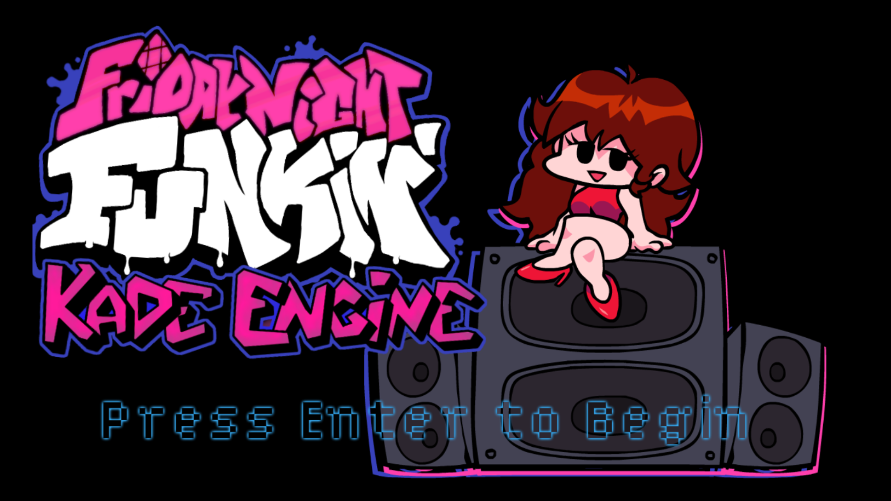
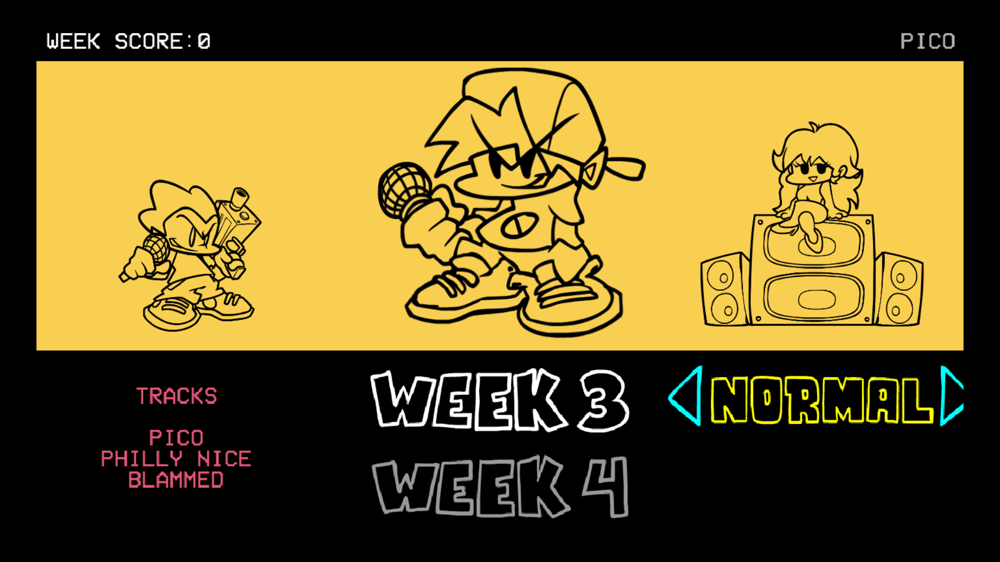
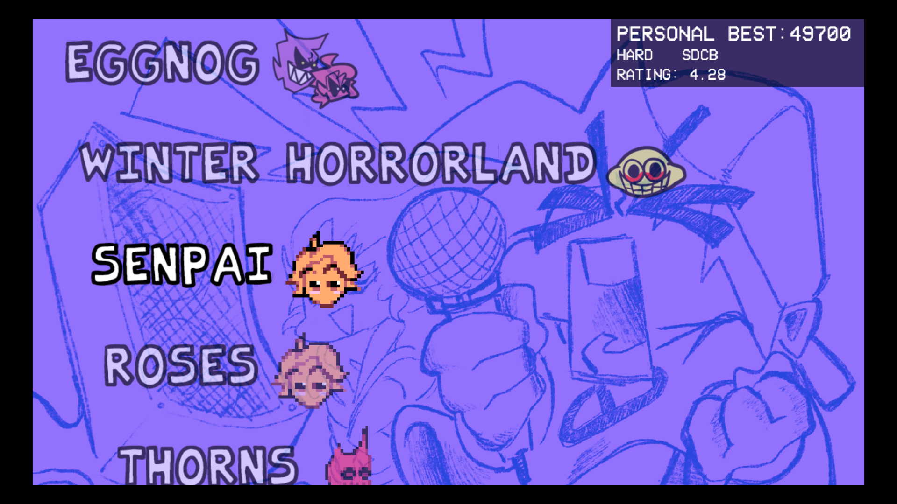
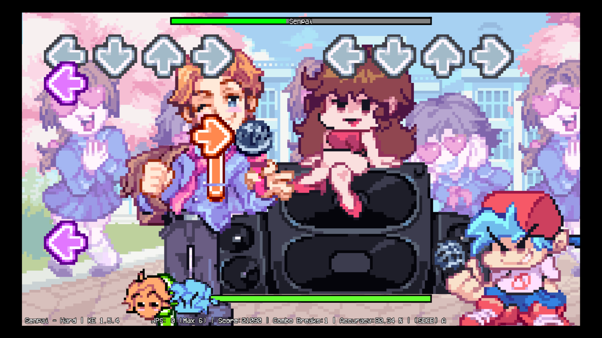
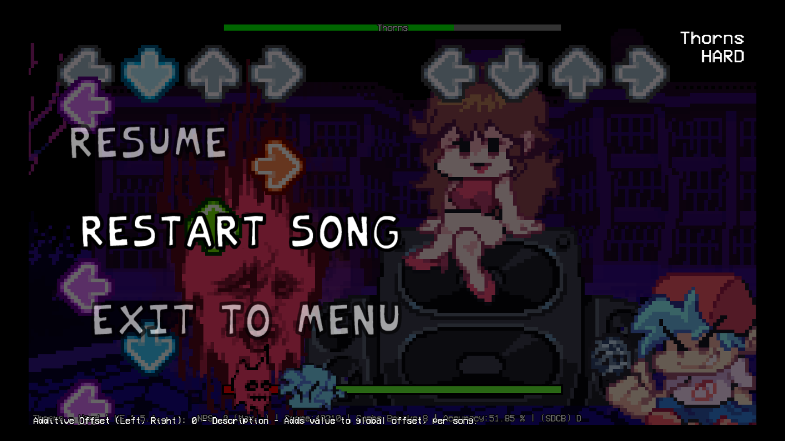
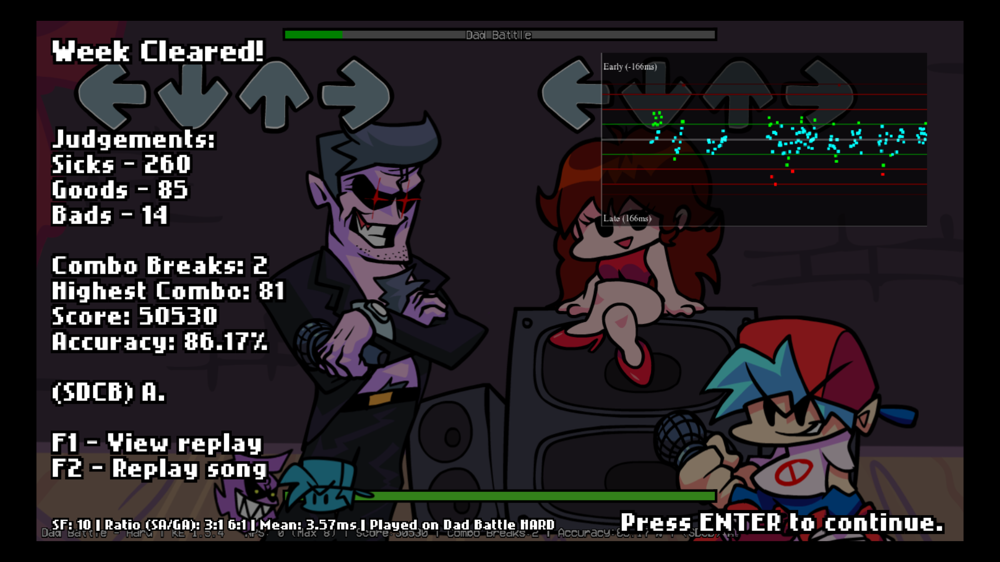
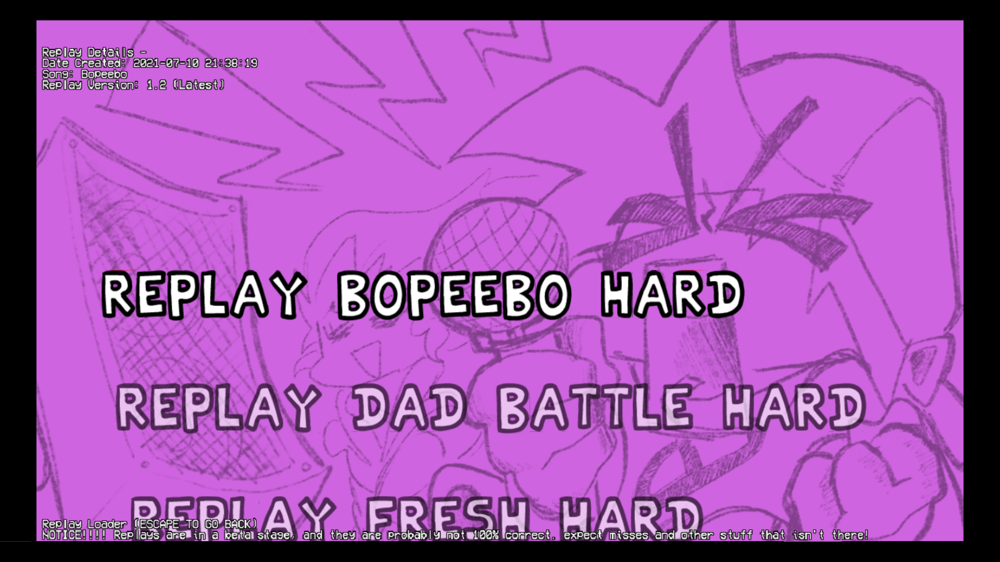

<!--  -->

[Last Funkin Moment image](https://github.com/Perkedel/After-Church/blob/master/RAW%20files/Inkscape/Week%20Strong/week-strong-thumb.svg )

# Last Funkin Moments

collection of FNF mods by Perkedel! Enjoy the funkin moment while it still last!

## Download NOW
- Odysee
  - [Linux x64](https://odysee.com/@JOELwindows7:a/last-funkin-moments:b?r=9hvWdwFXX2X5QfVxwhMoWQ5U1aWaNnvx )
  - [Linux 32 bit](https://odysee.com/@JOELwindows7:a/last-funkin-32bit )
  - [Win64](https://odysee.com/@JOELwindows7:a/last-funkin-moments-windows:c?r=9hvWdwFXX2X5QfVxwhMoWQ5U1aWaNnvx )
  - [Win32](https://odysee.com/@JOELwindows7:a/last-funkin-moments-windows32 )
  - [macOS](https://odysee.com/@JOELwindows7:a/last-funkin-moments-macOS)
  - [Android](https://odysee.com/@JOELwindows7:a/last-funkin-moments-android )
- GameBanana https://gamebanana.com/mods/293257
- NexusMods https://www.nexusmods.com/fridaynightfunkin/mods/247 
- Itch.io https://joelwindows7.itch.io/last-funkin-moments

If your antivirus went **sus**, they're dumb! None of these file are impostor, the antivirus is. vote that!  
I mean, if the antivirus thought that file is `malicious`, it's false positive. Ignore that, it's safe.  
if you don't trust it, check around the source code and its libraries referred.

## Status
- Linux   
- Linux ~~32 Bit~~Raspberry Pi 
- Windows 
- Windows 32 Bit 
- Android (built on Windows) 
- HTML5 (built on Windows) 
- macOS 

## We have:
Tons. check each today's update what has added yay.

<!-- (Unmarketed) We also have some yoinks from other mods without permission. Checkout [`CREDIT.md`](https://github.com/Perkedel/Kaded-fnf-mods/blob/master/CREDIT.md ) at section `other mods that wins the inclusion`. Yes, even we are *stealing* quote on quote, we always make sure mod page link url are always credited, along with their names of whom submited them. -->

check out [`CREDIT.md`](https://github.com/Perkedel/Kaded-fnf-mods/blob/master/CREDIT.md ) for stuffs involved during making of it this mod

enjoy the last drops of funkin before everything went. went, I can't say this. you don't want to hear this.

# Today's Update!
## 2021.07 Week Meta! Hookx again, but we are waiting for someone.
Hookx invited bf and gf again to a landscape view of mountain with a dead tree bark. They're waiting for someone.
### Today's update we got
- Week Meta. using internal UI musics. Getting Freaky, Game Over, Breakfast, Classic Menu song, and TEST.
- Amfrost stage where the Week Meta takes place! it got mountain view over there, a dead tree bark, and sandy ground.
- GF wears masker too!!! even demons respects health protocol, don't you people be ashamed by her?
- Stage loading JSON! load stage background images with JSON, or, Lua script the stage loading for even more advanced stuffs!
- Kade Engine 1.6
- Stepmania file support yay
- more options!!! (beware though, don't touch Reset data options)
- wuwuuwuwuwuwuwuw
## 2021.06 Week Strong! vs. Hookx the friendly Karaoke robot!

After the coronavirus pandemic seems regressing day by day as many vaccines clouter finally reaches family level, Boyfriend, Girlfriend, Pico, and families got their vaccines and all people can finally travel freely to all countries. The humanity once again gained victory in herd immunity. But what shall they do?

Boyfriend decided to go on to the opposite side of the world *to prove that he is the best rapper all around the world* (actually no, they're just bored after finding somebody to compete against, so..). well, turns out, that opposite side of the world isn't much edge of the world, infact that's where JOELwindows7 comes from, Indonesia. He heard from news that *the largest expo in Southeast Asia is going to open* at Jakarta. So then he invited all his friends and families to fly to Jakarta, Indonesia.

Jakarta Fair finally opens again after the gruelling cruelty of coronavirus has finally defeated. Boyfriend and families went to Jakarta fair for mere curiosity and who knows find someone that would compete with him. It had alot of stuffs, so they separate a while to look for interesting stuffs around the fair. Girlfriend will search for fashions, while Boyfriend looks for technologies. He found one of the megabooth that has sophisticated walking minibooth in it, Van Elektronische (Perkedel Technologies). He entered one of the booth and encountered Hookx, the friendly Karaoke robot.

Well, it's not the live person he met but another robot instead. Why not try though? I think Hookx got something interesting. So then Boyfriend proceed interacting with that robot that shapped like a portrait TV.
### Today we got
- Week Strong! vs. Hookx the friendly karaoke robot! ft. 3 TheFatRat Songs: Windfall, Rule The World, We'll meet again
- new **UNIQUE** stages (which unfortunately are also hard code too):
  - Jakarta Fair. inside one of the walking mini booth in the Van Elektronische booth
  - Qmoveph. our default background found in our softwares consisting of stars and circles, complemented with a blue hue on the top, gradiently browns towards the bottom, both sides loopable.
  - Fieldes. Yards with a bunch of hills behind it.
  - Cruel Thesis. a background with self explanatory accent strip on the bottom left corner with Van Elektronische brand logo in the center, complemented with purple themed hue diagonal gradients.
  - Colors screens!!! Solid color screen for chroma keying purposes! there are: Blue, Red, Green, Yellow, White, Blank! The characters and gf also also far distanced for easy management and further keyings later.
- new **UNIQUE** characters! (pls fix so I don't have to hard code):
  - Hookx the friendly karaoke robot. it's a portrait TV that can walk! it can also swivel its head 90 degrees!
  - Home Theater, while Girlfriend was busy looking for fashion or whatever physical distancing occassion needed, this Home theater is here. it has a modular landscape TV (which the screen and the computer (called TV evolution box thingy) are separatable), Sondkart GF-100 Soundbar, and a furniture to hold the TV evolution box and the soundbar.
  - **Boyfriend COVID-19 edition!** Boyfriend follows health protocol by **wearing mask** because he is outside. (bruh, he should've also been complying that on his home state lmao, but eh, COVID-19 is "*dead*" (technically no. they're already endemic unfortunately), humanity has reached peak herd immunity anyway, yeah but still) (but brother, bf's first week was on like 2020, and then subsequent was around 2021, oh no! and North America (US & probably Canada) had their worst time period during the peak rise of COVID-19!!!). Yeah just wear mask anyway when going out idk what comes here.
- **All without replacing weeks, stages, or even skin at all!** the vanilla assets and stuff still remains intact! (the week 7 is missing ~~placeholder (High effort Ugh)~~ and the original week 7 exclusive embargo is still ongoing as of 23 May 2021, Kickstarter ended, please don't break promise about timed, okay!)
- `BETA` ways to load weeks!!! with `weekList.json` file (located in `Assets/data/weekList.json`), you can edit the variable right away without needing to recompile entire game. finally! add weeks without recompile! more procedural loadings to come. (Pls fix week loader so we don't have to hard code, I guess it's done, idk)
- **Fresh**ly Forked from Kade Engine with love yay!
- **VIDEO CUTSCENER!!!** You can insert video in your song!!! thancc @GrowtopiaFli for the system. Available for both the start and end of each song, each difficulty!!! wow!!!! you can e.g. have different video even on each difficulty!!! ***no way!!!*** this is what should've been.
- **CHANGES IN DEFAULT STAGE!!!** Now reinstalled stage light. but that's not all, **we also have added the light bloom on it as well!!!** hey, it even change color too on demand, such as every cheer!!! whoah!!!!
- **NEW LUA MODCHART FUNCTIONS!!!**. We mirrored our special functions for the lua modchart too aswell. We got Cheer Now, Cam Zoom in, Set Colorable Background color, randomize the color, and more. FINALLY!!! We're getting closer to obsolette the hard coding! yeah!
- **Define Headbang permission in the chart!!!** this `allowedToHeadbang` variable that controls permission to `hey`, `cheers`, `nganguk / shake head`, etc. is now available for JSON chart!!! Now, you can set this each difficulty yay!
- **Define whether this song has dialog, in the chart!!!** you can now adjust `hasDialogueChat` (before song begin) & `hasEpilogueChat` (after song finish) to enable whether should this dialogue show. and also **IT WILL ALSO LOAD THE DIALOGUE AND EPILOGUE CHAT FILE FOR YOU!!!** WHOAH!!! that includes the video as well.
- **More Lua functions!!!** we have mirrored some or most of the special functions found in `Playstate` class, to Lua modchart. now you can go brrr with those function, mwuahahahahahaa!!! we also mirrored the variables too as well.
- 
- idk what next?
- CODE LICENSED GNU GPL v3 instead of some sort of *Open Source but proprietarism-allowing-forking* licenses. ASSETS (only for Perkedel originals like Week Strong, Week 4'33") Licensed CC4.0-BY-SA as shown in GameBanana Page!!! yoinkers, **you can steal this (the original Perkedel week ones yess) but pls credit!** oh, better be higher quality than ever pls, not just mere reupload, yeah serious (okay irony prevention. if your mod has any quality changes except this mod you yoinked which means you just yoink my mod (because no idea what to mod in Last Funkin Moment right now), but you did made other enhancement (your original mod, quality change internal and external), that's completely fine.). and of course, Share Alike remember? yess!! OPEN SOURCE BOTH MODS & ASSETS, for real (The FLA, SVG, PSD, KRA, XM, BLEND, FBX, anything! all format). Yes, it's a great privillege that KadeEngine (and FNF formerly but still compliant) is licensed Apache (the one that is Android). This license allow forker to change license, don't know to where ups or down, but basically we can enforce more here yeah. Ah yess, finally. License that is not absolutely restrictive at all.

### Features TheFatRat songs, Jakarta Fair, references, and more!
Windfall, Rule The World, & We'll meet again

- https://linktr.ee/TheFatRat
- [TheFatRat - Windfall](https://lnk.to/thefatratwindfall ) (*Tasty Records*)
- [TheFatRat & AleXa - Rule The World](https://lnk.to/thefatratruletheworld )
- [TheFatRat & Laura Brehm - We'll meet again](https://lnk.to/wellmeetagain )

BONUS WEEK! 4'33" . John Cage - 4'33" . John Cage did made a composition. and it's silent. just that. that's it. yes.

# Credits
as always, credits to all stuff involved will be on [`CREDIT.md`](https://github.com/Perkedel/Kaded-fnf-mods/blob/master/CREDIT.md ) thancc

# ERROR
## Missing files
...

# Misc
## [For the badge](https://forthebadge.com/ )

## some nice articles

### My Miku (Miku Expo 2021)
- http://paint.mikuexpo.com/studio.php?id=57afdd4ffe146803efca580c79002680 Hoyheid
- http://paint.mikuexpo.com/studio.php?id=39c96c01e2f6d5574f7c4afca74785e2 Genos Miku

### Old web meme, by BonkMaykr, one of the greatest Uberstylist here at GameBanana
https://gamebanana.com/blogs/19216  

yeah lol

## todo
- ~~redecorate for Perkedel temp week works~~
- ~~week strong. vs. Hookx the friendly singing portrait tv robot assistant~~
- hey, weren't we supposed to build sTILE instead?
- add constructive criticism about how unprocedural map loading is unlike other rhythm games
- abandon this mod when the procedural way of loading everything new (weeks, stages, background, scripts, etc.) has been ready on the upstream or the OG upstream, backport everything there.

## studio
We have studio in GameBanana https://gamebanana.com/studios/35672 . Just to seize the opportunity before anyone impersonate our brand, as well as to contain and collects our mods in GameBanana yay.

edit: goned the day. we lack more than 1 person after 1 week.

<!-- Kade Descriptions -->
# Kade Engine Descriptions

         

       

# Friday Night Funkin': Kade Engine

### If you want to contribute to Kade Engine, read [this](https://github.com/KadeDev/Kade-Engine/blob/stable/CONTRIBUTING.md) first.
### If you want to build Kade Engine, read [this](https://github.com/KadeDev/Kade-Engine/blob/stable/docs/building.md).

## Friday Night Funkin'
**Friday Night Funkin'** is a rhythm game originally made for Ludum Dare 47 "Stuck In a Loop".

Links: **[itch.io page](https://ninja-muffin24.itch.io/funkin) ⋅ [Newgrounds](https://www.newgrounds.com/portal/view/770371) ⋅ [source code on GitHub](https://github.com/ninjamuffin99/Funkin)**
> Uh oh! Your tryin to kiss ur hot girlfriend, but her MEAN and EVIL dad is trying to KILL you! He's an ex-rockstar, the only way to get to his heart? The power of music... 

## Kade Engine
**Kade Engine** is a mod for Friday Night Funkin', including a full engine rework, replays, and more.

Links: **[GameBanana mod page](https://gamebanana.com/gamefiles/16761) ⋅ [play in browser](https://funkin.puyo.xyz) ⋅ [latest stable release](https://github.com/KadeDev/Kade-Engine/releases/latest) ⋅ [latest development build (windows)](https://ci.appveyor.com/project/KadeDev/kade-engine-windows/branch/master/artifacts) ⋅ [latest development build (macOS)](https://ci.appveyor.com/project/KadeDev/kade-engine-macos/branch/master/artifacts) ⋅ [latest development build (linux)](https://ci.appveyor.com/project/KadeDev/kade-engine-linux/branch/master/artifacts)**

**REMEMBER**: This is a **mod**. This is not the vanilla game and should be treated as a **modification**. This is not and probably will never be official, so don't get confused.

## Website ([KadeDev.github.io/kade-engine/](https://KadeDev.github.io/Kade-Engine/))
If you're looking for documentation, changelogs, or guides, you can find those on the Kade Engine website.

# Previews ([skip](#features))

# Features

 - **New Input System**
	 - An improved input system, similar to Quaver or Etterna, with less delays, less dropped inputs and other improvements.
 - **More information during gameplay**
	 - While you're playing, we show you information about how you're doing, such as your accuracy, combo break count, notes per second, and your grade/rating.
 - **Customizable keybinds**
	 - Instead of being forced to use WASD and the arrow keys, you can set any keybinds you want!
 - **Replays** (in beta)
	 - Have you ever gotten a crazy score but didn't record? The replay system solves that: it automatically saves a "replay" of your gameplay every time you complete a song, which you can play back inside of the game. 
	 - Replays just store information about what you're doing, they don't actually record the screen -- so they take up way less space on your disk than videos.
 - **Audio offset**
	 - If your speakers or headphones are delayed, you can set an offset in the options menu to line the game up with the delay and play with synced audio like intended!
 - **And much, much more!**
	 - There's so much more in store than just what's listed here! If you can imagine a quality of life feature, it's probably
	 either already included in Kade Engine or is being worked on!

# Credits
### Friday Night Funkin'
 - [ninjamuffin99](https://twitter.com/ninja_muffin99) - Programming
 - [PhantomArcade3K](https://twitter.com/phantomarcade3k) and [Evilsk8r](https://twitter.com/evilsk8r) - Art
 - [Kawai Sprite](https://twitter.com/kawaisprite) - Music

This game was made with love to Newgrounds and its community. Extra love to Tom Fulp.
### Kade Engine
- [KadeDeveloper](https://twitter.com/KadeDeveloper) - Maintainer and lead programmer
- [The contributors](https://github.com/KadeDev/Kade-Engine/graphs/contributors)

### Shoutouts
- [GWebDev](https://github.com/GrowtopiaFli) - Video Code
- [Rozebud](https://github.com/ThatRozebudDude) - Ideas (that I stole)
- [Puyo](https://github.com/puyoxyz) - Setting up appveyor and a lot of other help
- [Smokey](https://github.com/Smokey555) - telling me that I should do the tricky asset loading
- [Poco](https://github.com/poco0317) - math degree (aka most of the fucking math in this project)
